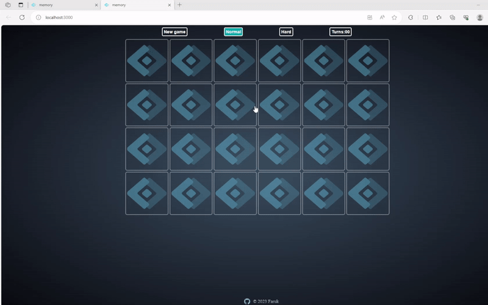

# **Memory Game**

## Deployed live version:
[play game](https://.vercel.app/)

## Description

- Simple memory game made with useState and useEffect hooks combined with css transitio to flip cards and match them 

## Basic features of this app:

- Playing on normal and hard mode
- Counting turns after flipping cards 

## This project uses the following technologies:

- [React](https://reactjs.org) fronted

## To get a local copy up and running, follow these steps:

1.  Clone the repository using your terminal: `git clone https://github.com/FarukC5/memory-game`

2.  Navigate to vaktija-api folder, and run `npm install` to install NPM packages. Then, run `npm start` to start this app.
